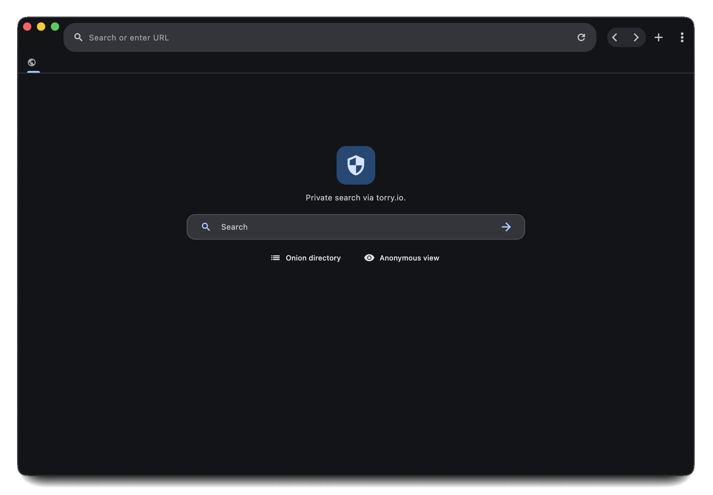

| `lint` | `flutter` |
|:--------- |:------------ |
| [](https://github.com/palmshed/via/actions/workflows/lint.yml) | [](https://github.com/palmshed/via/actions/workflows/flutter.yml) |

# Via



Flutter desktop browser with tabs, bookmarks, history, and encrypted settings storage. The app runs on macOS, Windows, and Linux.

## Quick start

Clone the repo, install dependencies, and launch the macOS bundle.

```bash
git clone https://github.com/palmshed/via.git
cd browser
flutter pub get
cp .env.example .env  # populate Firebase values before running
flutterfire configure --platforms macos
git checkout -- lib/firebase_options.dart  # keep runtime env vars
flutter run -d macos
```

Do not commit `.env`; it contains private Firebase keys.

## Firebase configuration

Firebase values are read from `.env` at runtime. The generated `lib/firebase_options.dart` stays under version control and references `const String` placeholders.

<details>
<summary>regenerate platform files after changing Firebase config</summary>

1. Update `.env` with the new Firebase project credentials.
2. Run `flutterfire configure --platforms macos` to refresh the generated files.
3. Run `git checkout -- lib/firebase_options.dart` to keep the environment-variable version.
4. Restart `flutter run` to pick up the new settings.

macOS also needs `macos/Runner/GoogleService-Info.plist`. `flutterfire configure` creates it, or you can copy it from the Firebase console. Keep `.env.example` as a template for local `.env` files.

</details>

## Development

- Requires Flutter 3.44.0 and the desktop toolchains for the target platforms.
- Run `./check.sh` to apply formatting, lint, and build checks shared across platforms.
- Build the signed macOS app with `flutter build macos` and adjust profiles with Xcode if needed.
- If you hit missing Firebase credentials while targeting macOS, double-check that `.env` is populated before launching the app.

## Release automation

[Release 1.28.9](https://github.com/palmshed/via/releases/tag/desktop/app-1.28.9) was the last desktop release published directly by GitHub Actions.
Current workflow automation uses the [browser-dart](https://github.com/apps/browser-dart) GitHub App where elevated repository access is needed, including release and project automation.

## Keyboard shortcuts

Keys are defined in `lib/utils/keyboard_utils.dart`.

| macOS | Windows/Linux | Action |
| --- | --- | --- |
| `Cmd + [` | `Alt + Left` | Navigate backwards in history |
| `Cmd + ]` | `Alt + Right` | Navigate forwards in history |
| `Cmd + R` | `Ctrl + R` | Reload the current tab |
| `Cmd + T` | `Ctrl + T` | Open a new tab |
| `Cmd + W` | `Ctrl + W` | Close the current tab |
| `Cmd + F` | `Ctrl + F` | Focus the address bar |
| `Cmd + Shift + F` | `Ctrl + Shift + F` | Open the page font picker |
| `Cmd + Option + Left` | `Ctrl + Shift + Tab` | Move to the previous tab |
| `Cmd + Option + Right` | `Ctrl + Tab` | Move to the next tab |
| `Cmd + Enter` | `F11` | Toggle fullscreen |
| `Cmd + M` | `Meta + Down` | Minimize the window |
| `Escape` | `Escape` | Close dialogs or stop loading |

## macOS unsigned installs (no paid Developer ID)

Unsigned builds can show Gatekeeper warnings. The first launch can stay in Finder:

1. Drag `Via.app` to **Applications**.
2. Right-click `Via.app`, choose **Open**, and confirm the dialog.
3. Alternatively, open **System Settings → Privacy & Security** and click **Open Anyway** for `Via.app`.

For Terminal installs, clear the quarantine flag with:

```bash
xattr -rd com.apple.quarantine /Applications/Via.app
```

Only run the command if you trust the build source.

## Need help?

- `docs/` contains focused project notes.
- `.codex/README.md` documents toolchains, skills, and local workflows.
- Report bugs or feature requests via [GitHub Issues](https://github.com/palmshed/via/issues).

## Generated files

`.gitattributes` marks generated files so GitHub hides them from diffs and stats. Common generated paths include:

- `build/**` and `.dart_tool/**`
- `lib/**/*.freezed.dart` and `lib/**/*.g.dart`
- Platform artifacts such as `android/**`, `ios/**`, `macos/**`, `linux/**`, and `windows/**`

When a specific file should be shown in diffs, add `-linguist-generated` to `.gitattributes` for that path.

## Contribute

Fork, create a branch, run the checks, then open a pull request with a short conventional commit-style summary.

## License

This project is proprietary. See `LICENSE` for the full terms.

Copyright (c) 2026 Palmshed. All Rights Reserved.
